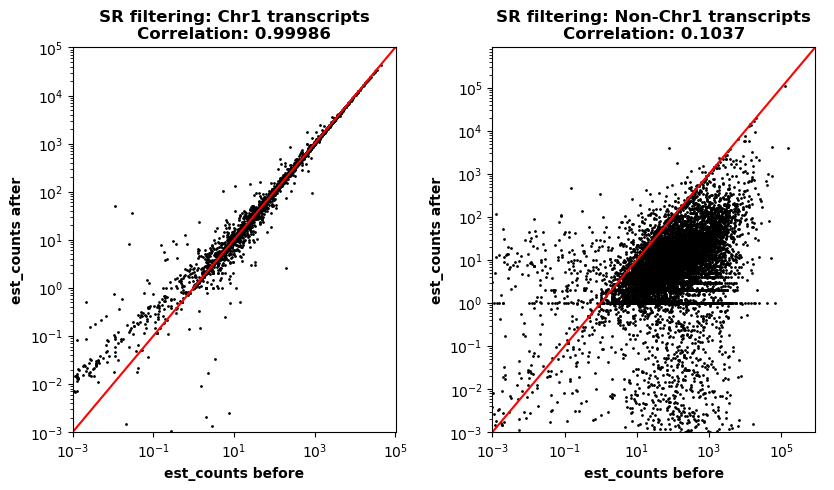

# MapSampler

Fast sampling of nucleotide sequences by mapping them to a reference using [Minimap2](https://github.com/lh3/minimap2).

Especially well-suited for filtering large query files with smaller references.

**Warning:**<br>
Might not be safe for use within server clusters

## Installation

```
git clone https://www.github.com/SimonHegele/MapSampler
cd MapSampler
conda env create -n mapsampler -f environment.yml
conda activate mapsampler
pip install .
```

## Usage

```
usage: mapsampler [-h] [-q] [-ql] [-qr] [-m] [-a] [-minq] [-maxq] [-minl] [-maxl] [-minm] [-maxm] [-t] [-tmp] [-l] [-v] reference

Sampling of nucleotide sequences by mapping to a reference

positional arguments:
  reference             Reference FASTA/FASTQ

options:
  -h, --help            show this help message and exit

Query-file(s):
  -q , --query          Query FASTA/FASTQ
  -ql , --query_left    Left query FASTA/FASTQ for paired-end Illumina short reads
  -qr , --query_right   Right query FASTA/FASTQ for paired-end Illumina short reads

Mapping:
  -m , --mode           Minimap2 mapping mode

Filtering:
  -a , --anti_filter    Anti filter: Select sequences without mappings meeting the criteria
  -minq , --minimum_quality
                        Minimum alignment quality [default: 0]
  -maxq , --maximum_quality
                        Maximum alignment quality [default: inf]
  -minl , --minimum_length
                        Minimum alignment length [default: 0]
  -maxl , --maximum_length
                        Maximum alignment length [default: inf]
  -minm , --minimum_matches
                        Minimum alignment length [default: 0]
  -maxm , --maximum_matches
                        Maximum alignment matchs [default: inf]

Others:
  -t , --threads        Number of threads CAUTION: Each thread loads the full reference!
  -tmp , --tempdir      Path to empty to non-existing temporary directory
  -l , --loglevel       Choose loglevel. Mostly logs information about the progess
  -v , --version        print version
```

### Output

<input.fasta/input.fastq>.ms

### Example:

`mapsampler -m sr -ql illumina_1.fastq -qr illumina_2.fastq -t 8 chr1_transcripts.fasta`

Input data:
- Query:     58,219,222 Illumina read-pairs pooled from six organs (brain, heart, kidney, liver, lung and stomach) of the mouse
- Reference: 7717 mouse chromosome 1 transcripts

Output data:
- 3,678,636 (~6,32%) of input Illumina read-pairs

Time (using 8 threads):
- real 7m24.496s
- user 36m32.332s

(Creating of a small scale benchmark data set for the evaluation of transcriptome assembly tools.)

<p align="center">
  
</p>

Transcript counts estimated with [Kallisto](https://github.com/pachterlab/kallisto) before and after filtering. Counts for chromosome 1 transcripts remain largely unchanged, counts for non-chromosome 1 transcripts are greatly reduced

## How it works

1. **File splitting:**<br>
   Splitting the query file(s) with Seqtk (one part per thread) and moving them to the temporary directory.
2. **Index creation:**<br>
   Minimap2 indexing using the allowed number of threads.
3. **Mapping:**<br>
   All parts of the query file(s) are mapped in parallel with single-threaded Minimap2.<br>
   As each Minimap2 process needs to load the index, the use of multithreading for larger references is limited.
4. **Filtering:**<br>
   All parts of query files(s) and their corresponding mapping files are proccessed in parallel.
   Because of the use of single-threaded Minimap2, query sequences and their corresponding mappings appear in the same order in their respective files.
   This allows to only load one query sequence and its corresponding mappings at a time.
   If there is at least one mapping satisfying the specified requirements, the read is either accepted (default) or rejected (if --anti_filter is set).
   Accepted reads are written to separate files.
5. **File merging:**<br>
   The files with accepted sequences are merged into a dedicate files.
6. **Cleanup:**<br>
   The temporary directory is removed even if the run fails. (Exception: KeyboardInterrupt)

Advantages and disadvantages of MapSampler arise from the splitting of query files and the use of multiple single-threaded Minimap2 instances.

+ Filtering step: almost invisible memory footprint
+ Filtering step: time scales linear with number of input sequences
+ File reading:   Splitting the query into multiple paths allows parallel reading and writing of files during intermediate steps

- Mapping step: Each parallel Minimap2 instance has to load the reference used during the filtering step.

MapSampler is well-suited for filtering arbitrarily large query read file(s) using references of limited size.

## Limitations / Issues

A behaviour that I have not observed for local machines but for our server cluster is that the number of output sequences drops dramatically with increasing number of used processes.


