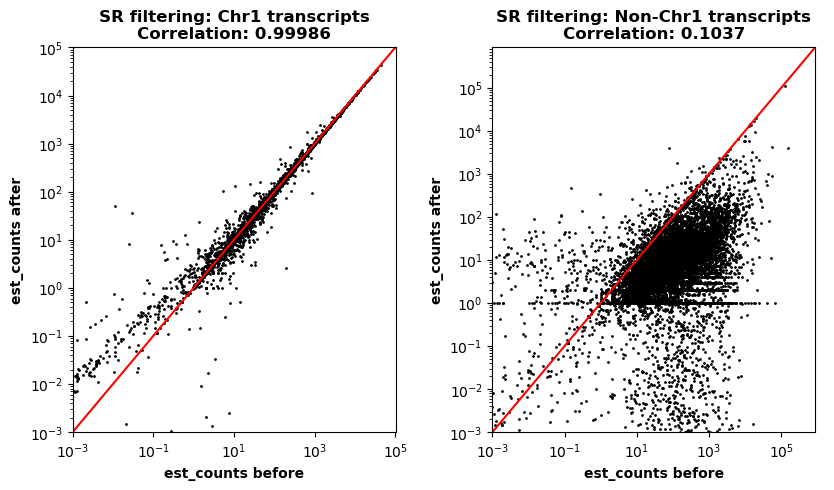

# MapSampler

Sampling of nucleotide sequences by mapping them to a reference

## Installation

### Python

**Version:**<br>
Python >= 3.10

**Requirements**
- psutil

### Third-party software

- Minimap2 (https://github.com/lh3/minimap2)
- Seqtk (https://github.com/lh3/seqtk)
(Available from Conda)

## Usage

```
python ms.py -h
usage: MapSampler [-h] [-q QUERY] [-ql QUERY_LEFT] [-qr QUERY_RIGHT] [-tmp TEMPDIR] [-m MODE] [-a ANTI_FILTER] [-minq MINIMUM_QUALITY] [-maxq MAXIMUM_QUALITY] [-minl MINIMUM_LENGTH] [-maxl MAXIMUM_LENGTH]
                  [-minm MINIMUM_MATCHES] [-maxm MAXIMUM_MATCHES] [-t THREADS] [--loglevel {debug,info,warning,error,critical}]
                  reference

Sampling of nucleotide sequences by mapping to a reference

positional arguments:
  reference             Reference FASTA/FASTQ

options:
  -h, --help            show this help message and exit
  -q QUERY, --query QUERY
                        Query FASTA/FASTQ
  -ql QUERY_LEFT, --query_left QUERY_LEFT
                        Left query FASTA/FASTQ for paired-end Illumina short reads
  -qr QUERY_RIGHT, --query_right QUERY_RIGHT
                        Left query FASTA/FASTQ for paired-end Illumina short reads
  -tmp TEMPDIR, --tempdir TEMPDIR
                        Path to empty to non-existing temporary directory
  -m MODE, --mode MODE  Minimap2 mapping mode
  -a ANTI_FILTER, --anti_filter ANTI_FILTER
                        Anti filter: Select sequences without mappings meeting the criteria
  -minq MINIMUM_QUALITY, --minimum_quality MINIMUM_QUALITY
                        Minimum alignment quality
  -maxq MAXIMUM_QUALITY, --maximum_quality MAXIMUM_QUALITY
                        Minimum alignment quality
  -minl MINIMUM_LENGTH, --minimum_length MINIMUM_LENGTH
                        Minimum alignment length
  -maxl MAXIMUM_LENGTH, --maximum_length MAXIMUM_LENGTH
                        Minimum alignment length
  -minm MINIMUM_MATCHES, --minimum_matches MINIMUM_MATCHES
                        Minimum alignment length
  -maxm MAXIMUM_MATCHES, --maximum_matches MAXIMUM_MATCHES
                        Minimum alignment length
  -t THREADS, --threads THREADS
                        Number of threads CAUTION: Each thread loads the full reference!
  --loglevel {debug,info,warning,error,critical}
                        Choose loglevel. Mostly logs information about the progess
```

### Output

<input.fasta/input.fastq>.ms

### Example:

Input data:
- Query:     58,219,222 Illumina read-pairs pooled from six organs (brain, heart, kidney, liver, lung and stomach) of the mouse
- Reference: 7717 mouse chromosome 1 transcripts

Output data:
- 3,678,636 (~6,32%) of input Illumina read-pairs

Time (using 8 threads):
- real 7m24.496s
- user 36m32.332s

(Creating of a small scale benchmark data set for the evaluation of transcriptome assembly tools.)

`python ms.py -m sr -ql illumina_1.fastq -qr illumina_2.fastq -t 8 chr1_transcripts.fasta`

<p align="center">
  
  <br>
  <em>Transcript counts estimated with Kallisto (https://github.com/pachterlab/kallisto) before and after filtering. Counts for chromosome 1 transcripts remain largely unchanged, counts for non-chromosome 1 transcripts are greatly reduced</em>
</p>
